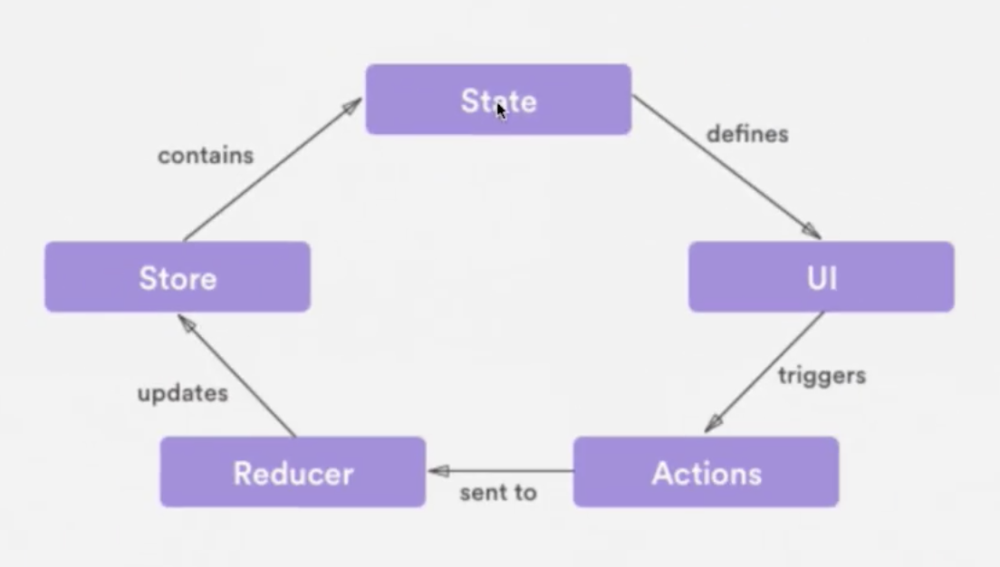

# Redux

*Redux es una implementación del patrón de “Observer”. El store de redux es en sí, la forma específica de cómo se lleva a cabo. Un store mantiene el árbol de estado (state tree) de tu aplicación. Si quieres cambiar el estado dentro del store, es necesario que hagas un dispatch sobre él.*


>Redux: es una librería creada por @dan_abramov, para manipular los datos de una forma separada de la interfaz, similar a lo que hace webpack con la opción hot-reload

>Es un contenedor del estado predecible para aplicaciones de JavaScript de front-end complejas.


### Componentes en Redux

* Store: Es el centro y la verdad de todo, con métodos para actualizar, obtener y escuchar datos.
* Actions: Son bloques de información que envian datos desde la aplicación hacia el store.
* Reducers: Cambian el estado de la aplicación.

### Diagrama



### Principios Redux

1. Única fuente de verdad:
El estado de toda tu aplicación esta almacenado en un árbol guardado en un único store lo que hace mas fácil el proceso de depuración.

2. Solo Lectura:
La única forma de modificar el estado es emitiendo una acción, un objeto que describe que ocurrió.

3. Los cambios se realizan con funciones puras:
Los reduces son funciones puras que toman el estado anterior y una acción, y devuelven un nuevo estado.

### Ciclo de Redux

* Tienes tu vista (UI)
* Tu vista va a enviar una acción
* Tu acción va a llamar un reducer
* Tu reducer va a llamar a tu store
* Tu store va a actualizar el estado
* El estado va a actualizar tu vista (interfaz/UI)


### Tres principios de Redux

* Única fuente de la verdad.
* El estado es de solo lectura.
* Los cambios se realizan con funciones puras. Una función que sea fácil de leer.

## Store
El centro y la verdad de todo, con métodos para actualizar, obtener y escuchar datos.

Datos importantes del Store:

1. Contiene el estado de la aplicación.
2. Se puede acceder al estado con el método getState()
3. Se puede actualizar el estado con el método dispatch(action)
4. Escucha cambios con el método **subscribe(listener)**
5. Deja de escuchar cambios retornando la función del método subscribe(listener)


>import { createStorage } from'redux'

> * Reducer => Función pura que retorna el próximo estado.

> * PreloadState / InitialState => Es el estado inicial de la aplicación, la primera carga, el llamado a una data. Puede ser cualquier tipo de dato.

> * Enhancer => Función que puede extender redux con capacidades añadidas por librerías externas. Es opcional. Eg. Añadir las dev-tools

* Reducer => Función pura que retorna el próximo estado.
* PreloadState / InitialState => Es el estado inicial de la aplicación, la primera carga, el llamado a una data. Puede ser cualquier tipo de dato.
* Enhancer => Función que puede extender redux con capacidades añadidas por librerías externas. Es opcional. Eg. Añadir las dev-tools

### Action

Bloque de información que envía datos a la aplicación.

#### Datos importantes:

* Se envían usando el método dispatch() del store.
* Son la única fuente de información del store.
* Son objetos planos de JavaScript.

### Reducers

Reducer = Modifica el estado.

* Es una función pura.
* Puede haber más de un reducer en una aplicación pero solo debe haber un store.
* Devuelve el siguiente estado.

#### ¿Qué es una función pura?

“Dados los mismos parámetros/argumentos/entradas deben retornar el mismo resultado, sin importar el número de veces que se llame”

#### Nunca hacer en un reducer

* Modificar sus argumentos
* Realizar tareas con efectos secundarios como llamados a APIs
* Llamar a funciones no puras como Date.now() Math.randow()

## Instalando React-redux

[github.com/reactjs/react-redux](github.com/reactjs/react-redux)

Vamos a la terminal y ponemos el siguiente comando:

```bash
npm install --save react-redux
```

Una vez que termine el proceso verás en el archivo package.json la dependencia instalada.

Por último corre el proyecto utilizando el siguiente comando:

```bash
npm run build:dev
```

### Conectando datos a los componentes

Conectaremos datos en específico dentro de nuestros componentes.
Primero obtendremos exclusivamente los datos que utiliza el componente.

Utilizaremos lo siguiente:
connect([mapStateToProps], [mapDispatchToProps], [mergeProps], [options]

[mapStateToProps(state, [ownProps]): stateProps] Es una función en la que si el argumento está especificado el nuevo componente se suscribe para recibir actualizaciones, lo que significa que cada vez que el store es actualizado la función mapStateToProps será llamada para obtener las propiedades.

### Normalizando Datos

[https://github.com/paularmstrong/normalizr](https://github.com/paularmstrong/normalizr)

### Immutable state

Resumen de métodos básicos de immutableJS sobre un mapa (objeto mapeado).

* mapa.get('key'): Obtiene el valor de ‘key’ en el mapa.

* mapa.getIn(['key','sub-key']): Obtiene el valor de ‘sub-key’, que es un mapa hijo (de segundo nivel) asociado a ‘key’ en el mapa original.

* mapa.set('key','valor'): Retorna un nuevo mapa donde el valor de ‘key’ ha sido remplazado por ‘valor’.

* mapa.merge({key1:'valor1',key2:'valor2'}): Retorna un nuevo mapa que es el resultado de mezclar (consolidar) el mapa original y el mapa pasado por parametro como objeto.


### Creadores de Acciones
Empaquetamos nuestras acciones en funciones que reciben los parámetros de la acció<n class=""></n>

### Enlazando creadores de acciones

Usamos los bindActionCreators de redux

```javascript
import { bindActionCreators } from 'redux';
```

y al moment de export la función hacemos:

```javascript
export default connect(mapStateToProps, mapActionsToProps)(Search);
```

si la función no tiene mapStateToProps podemos hacer directamente lo siguiente:

```javascript
export default connect(null, mapActionsToProps)(Search);
```

### Action Types

Para no repetir los textos manuales de nuestros strings manuales que están en los reducers.

```javascript
export const OPEN_MODAL = 'OPEN_MODAL';

export const CLOSE_MODAL = 'CLOSE_MODAL';

export const SEARCH_ENTITIES = 'SEARCH_ENTITIES';
```